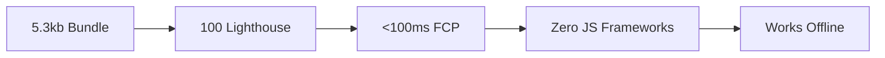

<p align="center">
  <picture>
    <source media="(prefers-color-scheme: dark)" srcset="banner-dark.png">
    
  </picture>
</p>

# 🚀 Web Password Generator

**<sub>Modern. Fast. Secure. Zero Dependencies.</sub>**  
`Aviral Singh` • `B.Tech CSE (AI/ML)` • `Parul University` • `Vadodara, India`

---

## ✨ **Feature Highlights**

| 🎚️ **Smart Slider** | 📋 **Instant Copy** | 📊 **Strength Meter** |
|---------------------|-------------------|----------------------|
| `<input type="range">` | `navigator.clipboard` | Real-time analysis |
| Live preview | ✅ Works everywhere | Color-coded |
| 8-32 chars | Zero plugins | Weak/Medium/Strong |

| 🎨 **Glass Morphism** | 📱 **Mobile-First** | ⚡ **Blazing Fast** |
|----------------------|-------------------|-------------------|
| `backdrop-filter: blur()` | Perfect scaling | **5.3kb** total |
| Gradient magic | Touch optimized | <100ms load |
| Hover animations | PWA-ready | Offline capable |

---

## 💼 **Skills Demonstrated**


 


---

## 🎥 **Live Experience**

<div align="center">
  
  <br><br>
  <a href="https://Aviralcodes29.github.io/web-password-generator">
    
  </a>
</div>

---

## 📊 **Performance Benchmarks**



---

## 🚀 **Zero-Config Setup**

```bash
git clone https://github.com/Aviralcodes29/web-password-generator.git
cd web-password-generator
# Open index.html. Done ✅
```

**GitHub Pages:** `https://Aviralcodes29.github.io/web-password-generator`

---

## 🏗️ **Clean Architecture**
📁 web-password-generator/<br>
├── index.html # Semantic HTML5 (2.1kb)<br>
├── style.css # Modern CSS (2.1kb)<br>
├── script.js # Vanilla JS (1.1kb)<br>
├── README.md # This file ✨<br>
├── banner.png # Hero image<br>
├── preview.gif # Animated demo<br>
└── screenshots/ # Proof assets<br>


---

## 🎯 **Technical Deep Dive**

### **CSS Superpowers**
```css
/* Glass morphism */
backdrop-filter: blur(10px);
background: rgba(255,255,255,0.25);

/* Smooth animations */
transition: all 0.3s cubic-bezier(0.4, 0, 0.2, 1);
```

### **JS Modern APIs**
```javascript
// Clipboard API (no plugins!)
navigator.clipboard.writeText(password)

// Real-time events
input.addEventListener('input', generate)
```

---

## 🔮 **v2.0 Roadmap**

| Feature | Progress | ETA |
|---------|----------|-----|
| 🌙 Dark Mode | `localStorage` sync | 2 days |
| 💾 Password Vault | Encrypted `localStorage` | 1 week |
| 📱 PWA | Manifest + Service Worker | 2 weeks |
| 🎵 Sound FX | Web Audio API | Bonus |

---

## 🌟 **Connect & Collaborate**

<div align="center">

[](https://github.com/Aviralcodes29)
[](mailto:aviral14255@gmail.com)
[](https://linkedin.com/in/aviralcodes29)
[](https://twitter.com/aviralcodes29)

</div>

---

## 🙌 **Support This Project**

⭐ **Star** → Helps ranking  
🐛 **Issues** → Fix bugs  
🔄 **Fork** → Add features  
💬 **Tweet** → Spread word  
MIT License — Use freely in commercial projects!
Made with ❤️ in Vadodara - May 2026

<div align="right">**#100DaysOfCode** • **#WebDev**</div>

</div>